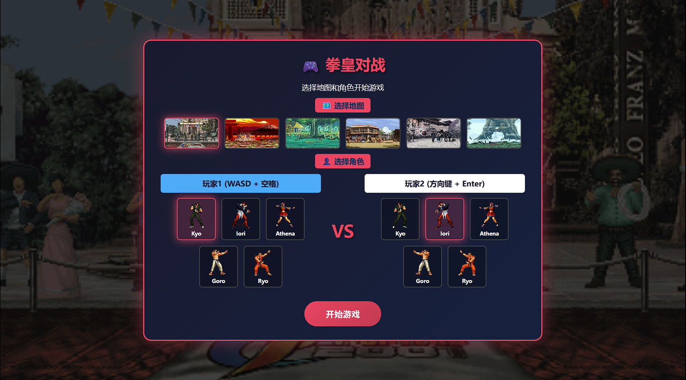

# 🎮 KOF-MiniGame

**一个拳皇风格的双人对战小游戏** 👊

## 🛠️ 技术栈

[](https://developer.mozilla.org/en-US/docs/Web/API/Canvas_API)
[](https://developer.mozilla.org/en-US/docs/Web/CSS)
[](https://www.ecma-international.org/ecma-262/6.0/)
[](https://jquery.com/)

## 📸 游戏截图

<div align="center">
  
</div>

## ✨ 功能特性

| 特性 | 描述 |
|:---:|:---|
| 🕹️ | 双人本地对战，和朋友一起玩 |
| 🎨 | GIF 动画角色渲染，流畅的战斗动作 |
| ⏱️ | 60秒倒计时，紧张刺激 |
| ❤️ | 血条系统，实时显示战斗状态 |

## 🎯 操作说明

| 操作 | 🎮 玩家1 | 🎮 玩家2 |
|:----:|:-------:|:-------:|
| ⬆️ 跳跃 | `W` | `↑` |
| ⬅️ 左移 | `A` | `←` |
| ➡️ 右移 | `D` | `→` |
| 👊 攻击 | `Space` | `Enter` |

## 🚀 快速开始

```bash
# 1. 克隆项目
git clone https://github.com/Skyler-Luo/KOF-MiniGame.git

# 2. 进入项目目录
cd KOF-MiniGame

# 3. 使用本地服务器运行（如 VS Code Live Server 插件）
# 4. 打开浏览器访问 index.html
```

## 📁 项目结构

```
KOF-MiniGame/
├── 📂 static/
│   ├── 📂 css/              # 样式文件
│   ├── 📂 js/               # JavaScript 模块
│   │   ├── 📂 game_object/  # 游戏对象基类
│   │   ├── 📂 controller/   # 键盘控制器
│   │   ├── 📂 game_map/     # 游戏地图
│   │   ├── 📂 player/       # 玩家角色
│   │   └── 📂 utils/        # 工具类
│   └── 📂 images/           # 图片资源
├── 📂 templates/            # HTML 模板
└── 📄 README.md
```

## 📝 License

本项目采用 [MIT License](LICENSE) 开源协议

---

<div align="center">

⭐ **如果觉得不错，欢迎 Star！** ⭐

Made with ❤️ by [Skyler-Luo](https://github.com/Skyler-Luo)

</div>
